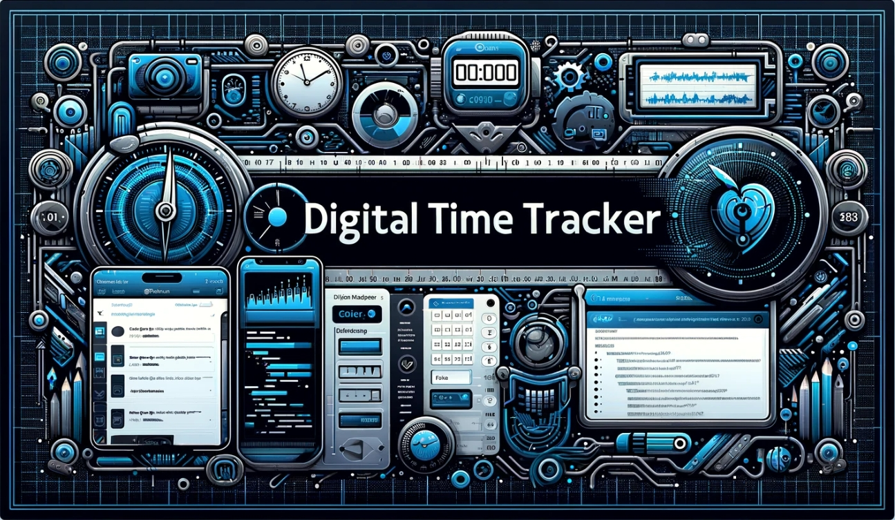

# Digital-Uptime-Footprint

This is my digital uptime and productivity tracker, implemented in my laptop for development and research purpose (No puns intended haha)

# My Active Time: 

# Purpose:

Track when I log into my laptop to do work related stuffs. A fun little automation script to run at each startup and control my productivity time management.

# My Digital Footprint:

| ACTIVE :: 01-02-2024 07:08:36 PM PST | DIFFERENCE :: 2 Minutes, 20 Seconds |  
| ACTIVE :: 01-02-2024 07:10:56 PM PST | DIFFERENCE :: 1 Minutes, 35 Seconds |  
| ACTIVE :: 01-02-2024 07:12:31 PM PST |
 DIFFERENCE :: 2 Minutes, 11 Seconds |  
| ACTIVE :: 01-02-2024 07:14:42 PM PST |